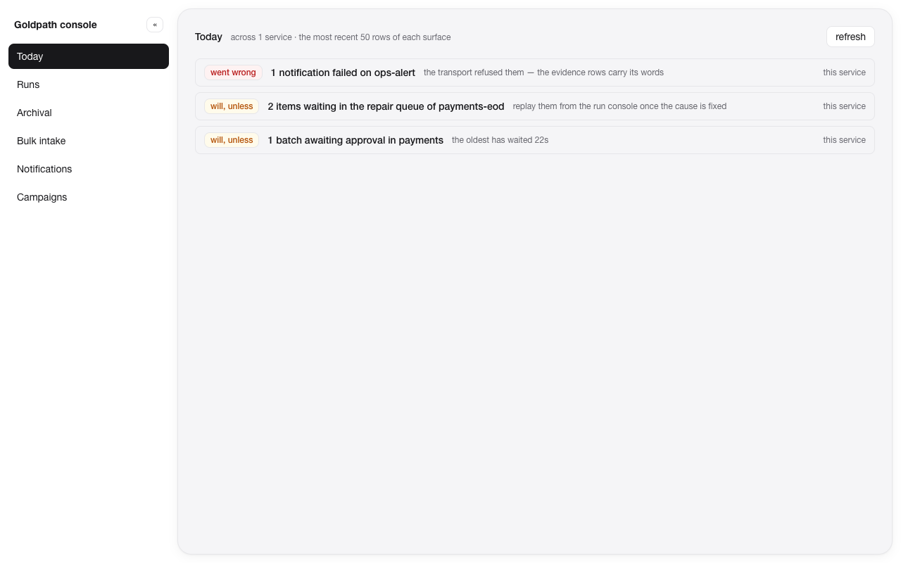
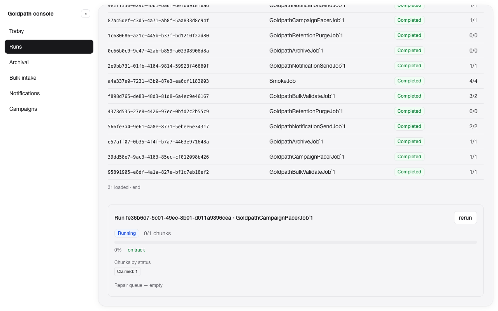
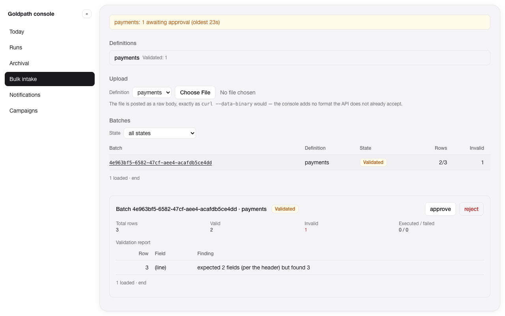

# Goldpath — Enterprise .NET Asset

[](https://github.com/omercelikdev/goldpath/actions/workflows/ci.yml)
[](https://github.com/omercelikdev/goldpath/actions/workflows/nightly.yml)
[](LICENSE)
[](https://www.nuget.org/packages?q=Goldpath)

AI-native, spec-driven enterprise .NET accelerator: composable NuGet libraries +
templates + AI skills + guardrails + living documentation. Not a framework — a
**golden path**: a road paved with enterprise opinion on top of Microsoft (Aspire, Extensions.*).

> **New here? [The guide](docs/guide/README.md)** — getting started, the six concepts,
> the CorPay tour, proof stories. Conceptual grounding:
> [Strategy/Foundation](docs/strategy/foundation.md) · Constitution: [ADR-0001..0010](docs/adr/README.md)

## What it is / is not

- ✔ Composable packages — added to an existing project in 5 minutes (L1) or scaffolded from scratch (L3)
- ✔ Spec-driven: `.goldpath/manifest.yaml` + OpenAPI/AsyncAPI as the single source of truth
- ✔ AI in the development layer: skills generate, guardrails verify, humans approve
- ✔ Proof-driven: every claim below is a test/bench that runs in CI (nightly 10-shape golden-manifest matrix, real containers)
- ✘ Not a framework (imposes no structure), no custom DSL, no wrappers around Microsoft

## Quickstart

```bash
dotnet new install Goldpath.Templates@0.1.0-preview.4    # preview: pin the version
dotnet tool install -g Goldpath.Cli --prerelease
dotnet tool install -g specdrift                         # the deterministic engine behind goldpath check/add

dotnet new goldpath-solution -n Acme.Orders --db postgresql --broker rabbitmq --features bulk
cd Acme.Orders && goldpath check           # spec validate + drift + build, one verb
dotnet run --project src/Acme.Orders.AppHost
```


Grow it feature by feature: `goldpath add feature notification`, `goldpath add worker`,
`goldpath db add AddInvoices`. Every admin surface (`/goldpath/admin/*`) is fail-closed,
audited and [contract-frozen](docs/rfc/goldpath-admin-contract.md); every module ships
its Grafana board, runbooks and [measured performance](docs/ops/release-checklist.md)
on a pinned CI profile.

## The console

One line — `app.MapGoldpathConsole()` — and the app serves its own operations console out
of the `Goldpath.Console` package's embedded assets: no Node on the running system, behind
the same fail-closed ops floor as `/goldpath/admin/*`, and lit only by the modules the app
actually composes.

**Today** answers the only question an operator opens a console to ask, across every
service in the registry, before opening any of them:



**Runs** discovers the fleets from the store — every run with its chunks, its repair queue
and its deadline verdict, and `rerun` for the one that failed:



**Bulk intake** puts the engine's own validation report under the four-eyes gate, so the
person approving sees exactly which row the file got wrong:



These are captured, never mocked: `scripts/console-screenshots.sh` brings up Postgres and
RabbitMQ, runs a real app, uploads a real file, triggers real jobs, and photographs what
comes back. The console is proven the same way — `scripts/console-smoke.sh` drives three
real apps (open, auth-floored, tenant-scoped) plus the app-served console, under an axe
accessibility gate.

## What's in the train

| Layer | Packages |
|---|---|
| Floor (Ring A) | Abstractions · ServiceDefaults · ApiDefaults · Data · Messaging |
| Cross-cutting (Ring B) | Auth · Idempotency · AuditTrail · MultiTenancy · SoftDelete · Locking (+SqlServer) · Caching · DataProtection |
| Execution ladder (L2→L4) | Jobs (clustered, checkpointed, kill-9-recoverable) · Archival · Bulk (finance-grade intake→gate→execute→repair) · Notification · Campaign (paced fan-out, live throttle) |
| Operations | Console (`MapGoldpathConsole()` — the app serves its own, from embedded assets) |
| Tooling | Analyzers (GP#### executable standards) · `goldpath` CLI · `Goldpath.Templates` |

## Monorepo Layout

| Directory | Contents |
|---|---|
| `docs/strategy/` · `docs/adr/` · `docs/rfc/` | Strategy, the 10-ADR constitution, module RFCs + frozen contracts |
| `docs/guide/` · `docs/stories/` | The adopter's path (start here) · proof stories |
| `docs/ops/` · `docs/upgrades/` | Migrations/trace/release runbooks · per-release upgrade guides |
| `schemas/manifest/v1/` | Manifest JSON Schema + valid/invalid corpus (CI corpus gate: valid must pass, invalid must fail) |
| `packages/` · `analyzers/` | The NuGet train (20 packages) · GP#### Roslyn rules |
| `templates/` · `tools/` | `dotnet new` pack (solution + worker) · the `goldpath` CLI |
| `ui/kit/` · `ui/console/` | The console's primitives · the console itself (embedded into `Goldpath.Console`) |
| `tests/` | 619 unit + 32 integration proofs (Testcontainers) + bench suite; 204 UI unit tests + a browser smoke against three real apps |
| `skills/` · `rulesets/` · `samples/` | pointers — the shipped skill layer and rulesets live inside `templates/` · reference app (CorPay) |

## Language Policy

Everything in this repo — documentation, code, identifiers, commits, PRs — is **English**.
Conversation with the team may be Turkish. In customer repos, the domain-memory language is
chosen per customer (Turkish by default for Turkish customers — see domain-memory-v1 §4).

## Dependency Policy

Every dependency, including first-party OSS (Mediant, Mockifyr, Spec Engine — personal GitHub),
is consumed as a **published, pinned NuGet package** (nuget.org → internal mirror where required). Source
references/submodules are forbidden. Details: foundation §10.

## Versioning & Support

One version train: every `Goldpath.*` package, the CLI and the template pack ship the
same version. SemVer with the pre-1.0 rules spelled out — `0.x.y` patches are always
safe to take blind; `0.(x+1)` minors may break but never silently: every break ships
with a step-by-step upgrade guide (`docs/upgrades/`), and the `PublicAPI.*.txt` ledger
diff is the mechanical proof of what changed. Support: latest release only pre-1.0;
from 1.0, previous major gets security fixes for 6 months. The full written contract:
[docs/rfc/goldpath-versioning.md](docs/rfc/goldpath-versioning.md).
